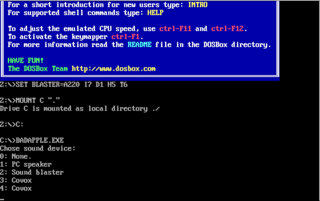
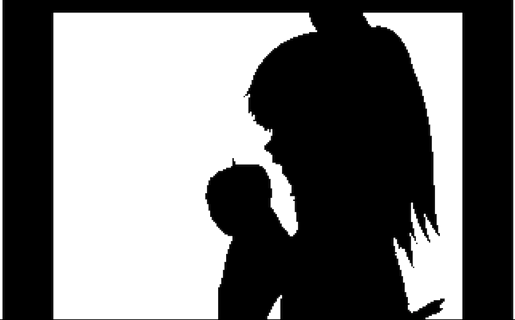

# BadAppleJS
JavaScript port of "Bad Apple!!"

# Description
Displaying [Bad Apple!!](https://www.youtube.com/watch?v=IXOVUiyx1a8) animation in the web browser.

This is made by [emscripten](https://github.com/kripken/emscripten) and [em-dosbox](https://github.com/dreamlayers/em-dosbox), and plays [Bad Apple!! DOS version](http://abaduaber.ru/Prog.htm).

# How To Play

1. Access the URI
https://sairoutine.github.io/BadAppleJS/

2. You'll be asked "Choose sound device", so input 3 and Enter.

3.  You'll be asked "Press enter to start", so input Enter.

And, You will see Bad Apple!! animation :tada:

Note: If it is shown "Exception thrown, see JavaScript console", Please reload the browser.

# ScreenShot

